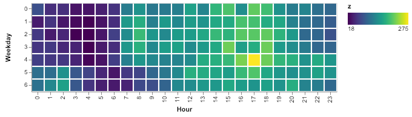
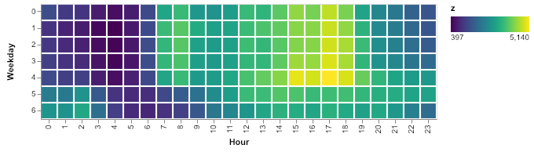
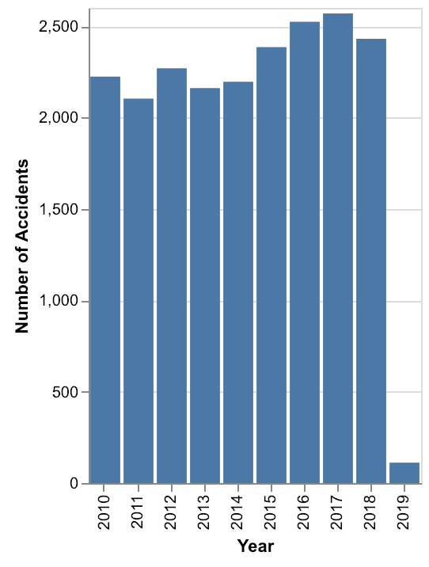

### Tools for processing CSV data

Tests here are done with a Los Angeles city data file.

This is a thin layer above pandas and altair.

### Overview:  Why is this necessary?

There is lots of great data, like Los Angeles city data at https://data.lacity.org/
and some amazing tools for processing and visualizing the data.

Here we have a single interface with minimal commands
for processing and visualizing data.

### Command summary:
These load, process, and visualize data.

Command formats:
- Load: data_frame_name = path_to_CSV_file
- Save: data_frame_name.save
- Remove columns: data_frame_name.drop comma_delimited_list_of_column_names
- Create column: data_frame_name.new_column_name <= python_code_returning_ALL_column_values

Here is a test script that shows how these look:
```
# Load collision data into "bar_graph_1" DataFrame
bar_graph_1 = data/sample_20_Traffic_Collision_Data_from_2010_to_Present.csv

# Display the columns loaded (to verify the load was successful)
bar_graph_1.columns

# Get rid of the columns we aren't using
bar_graph_1.drop DR Number, Date Reported, Area ID, Reporting District
bar_graph_1.drop Crime Code, Crime Code Description, MO Codes, Premise Code
bar_graph_1.drop Premise Description, Location

# Create some new columns
bar_graph_1.Date <= [pd.to_datetime(x) for x in dataFrame['Date Occurred']]
bar_graph_1.Weekday <= [x.weekday() for x in dataFrame['Date']]
bar_graph_1.Year <= [x.year for x in dataFrame['Date']]

# Show the current state of the columns (to verify changes)
bar_graph_1.columns

# Save the DataFrame "bar_graph_1" into a CSV file "bar_graph_1.csv"
bar_graph_1.save
```

### Example:  Heat Map for Northeast LA Collision Data

I live in NELA, and a few communities have put up "Slow Down" signs, and there
is a city focus on significantly reducing the number of traffic accidents.

Given the city data, how would I get a Heat Map that shows how accidents are
distributed by Day of the Week and Hour of the Day?   Here's what it looks like:



```
load expected/all_areas.Area_Name.Northeast.csv as Northeast
heat Northeast Hour Weekday
```


It looks like Northeast LA gets quite a few more accidents at 5 PM on Fridays.  How does that look for
all of Los Angeles?



```
load expected/all_areas.csv as all_areas
heat all_areas Hour Weekday
```


Both those depend on CSV files generated from the Los Angeles city
data file.  Those files were generated with this code:
```
# Load collision data into DataFrame "all_areas"
load ../data/real/Traffic_Collision_Data_from_2010_to_Present.csv as all_areas

# Display the columns (verify load)
columns all_areas

# Drop unused columns
drop all_areas DR Number, Date Reported, Area ID, Reporting District, Crime Code
drop all_areas Crime Code Description, MO Codes, Premise Code, Premise Description, Location

# Create columns for grouping
create all_areas Date [pd.to_datetime(x) for x in dataFrame['Date Occurred']]
create all_areas Weekday [x.weekday() for x in dataFrame['Date']]
create all_areas Year [x.year for x in dataFrame['Date']]
create all_areas Hour [math.floor(x/100) for x in dataFrame['Time Occurred']]

# Save DataFrame "all_areas" to CSV file "all_areas.csv"
save all_areas

# create CSV files for each "Area Name"
# This creates files like:  all_areas.Area_Name.Northeast.csv
filter all_areas by Area Name

```
##### DataFrame:  Load a CSV file into DataFrame
The command below loads a CSV file into a DataFrame (accessed by other commands)
named "all_areas"

```
load ../data/real/Traffic_Collision_Data_from_2010_to_Present.csv as all_areas
```

##### DataFrame:  Add a column
To create a new column based on values in an existing column:
```
create graph1 Date [pd.to_datetime(x) for x in dataFrame['Date Occurred']]
create graph1 Weekday [x.weekday() for x in dataFrame['Date']]
create graph1 Year [x.year for x in dataFrame['Date']]
```
The above creates DataFrame columns "Date", "Weekday", and "Year".  The
code to the right of the column name is Python code used to assign each
value in the column.  In the example above,
the "pd" in "pd.to_datetime(x)" is from ```import pandas as pd```.

The "Date" column is an actual Date datatype, the "Weekday" becomes a value 0
through 6, where Monday is 0 and Sunday is 6, and "Year" becomes a numeric
value.

##### DataFrame: Remove a column

One or more columns can be dropped.
```
drop all_areas DR Number, Date Reported, Area ID, Reporting District
```

##### DataFrame: save CSV file
Always saves to <DataFrame name>.csv.  The DataFrame name
is set when DataFrame is loaded.

```
save all_areas

```
The above saves DataFrame "all_areas" to a file "all_areas.csv"

##### Graph: draw a Bar Graph

##### Graph: draw multiple Bar Graphs
```
load expected/all_areas.csv as all_areas
filter all_areas by Area Name
mbar all_areas Area Name X|Year:O|Year Y|count()|Number+of+Accidents
```
This creates bar graphs for each year, one bar graph per area.
Below is the "Northeast.png" bargraph.  A similar graph is created
for each area included in the collision data.



##### Graph: draw a Heat Map

```
heat <dataFrameName> <xDimension> <yDimension>
```

For example, if with a "Year" and "Weekday" column in the
DataFrame "all_areas", the command to draw a heatmap
is:
```
heat all_areas Year Weekday
```
The heatmap image is saved to "all_areas.Year.Weekday.heatmap.png"
