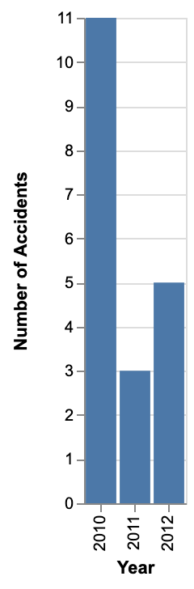

### Tools for processing CSV data

Tests here are done with a Los Angeles city data file.

This is a thin layer above pandas and altair.

### Overview:  Why is this necessary?

There is lots of great data, like Los Angeles city data at https://data.lacity.org/
and some amazing tools for processing and visualizing the data.

Here we have a single interface with minimal commands
for processing and visualizing data.

### Command summary:
These load, process, and visualize data.

Command formats:
- Load: data_frame_name = path_to_CSV_file
- Save: data_frame_name.save
- Remove columns: data_frame_name.drop comma_delimited_list_of_column_names
- Create column: data_frame_name.new_column_name <= python_code_returning_ALL_column_values

Note: the python code is executed with "eval", any imports it requires
need to be manually put in commands/data_frame.py (e.g. this imports "math"
due to a script reference, even though it is not used in the file)

### Example #1:  Test data, 20 records

Here is a test script loads data, removes columns, adds new columns, saves the
data into a CSV file, and draws a bar graph:

```
# Load collision data into "bar_graph_1" DataFrame
bar_graph_1 = data/sample_20_Traffic_Collision_Data_from_2010_to_Present.csv

# Get rid of the columns we aren't using
bar_graph_1.drop DR Number, Date Reported, Area ID, Reporting District
bar_graph_1.drop Crime Code, Crime Code Description, MO Codes, Premise Code
bar_graph_1.drop Premise Description, Location

# Create some new columns
bar_graph_1.Date <= [pd.to_datetime(x) for x in dataFrame['Date Occurred']]
bar_graph_1.Weekday <= [x.weekday() for x in dataFrame['Date']]
bar_graph_1.Year <= [x.year for x in dataFrame['Date']]

# Save the DataFrame "bar_graph_1" into a CSV file "bar_graph_1.csv"
bar_graph_1.save

# Draw a bar graph using "Year" for X axis, and "Number of Accidents" for Y axis
# Notation for axes is passed to altair
bar_graph_1.bar X|Year:O|Year, Y|count()|Number of Accidents
```

This resulting graph looks like this:



### Example #2:  Heat Map for Northeast LA Collision Data

Given the city collision data, how would I get a Heat Map that shows how accidents are
distributed by Day of the Week and Hour of the Day?   Here's what it looks like for Northeast LA:


```
Northeast = expected/all_areas.Area_Name.Northeast.csv
Northeast.Hour.Weekday => heatmap
```

Here is what it looks like for all LA:


```
all_areas = expected/all_areas.csv
all_areas.Hour.Weekday => heatmap
```

Both those depend on CSV files generated from the Los Angeles city
data file.  The "all_areas.csv" file was generated with this script:
```
# Load collision data into DataFrame "all_areas"
all_areas = ../data/real/Traffic_Collision_Data_from_2010_to_Present.csv

# Display the columns (verify load)
all_areas.columns

# Drop unused columns
all_areas.drop DR Number, Date Reported, Area ID, Reporting District, Crime Code
all_areas.drop Crime Code Description, MO Codes, Premise Code, Premise Description, Location

# Create columns for grouping
all_areas.Date <= [pd.to_datetime(x) for x in dataFrame['Date Occurred']]
all_areas.Weekday <= [x.weekday() for x in dataFrame['Date']]
all_areas.Year  <= [x.year for x in dataFrame['Date']]
all_areas.Hour <= [math.floor(x/100) for x in dataFrame['Time Occurred']]

# Save DataFrame "all_areas" to CSV file "all_areas.csv"
all_areas.save
```

To get the individual CSV files for each area, for example the CSV file all_areas.Area_Name.Northeast.csv:

```
# all_areas is the DataFrame from the above example
# 
# create a CSV file for unique "Area Name" value:  all_areas.Area_Name.<value>.csv
#
all_areas.filter Area Name
```

To see accidents by Area Name requires deleting unused columns, otherwise I'm getting
an error (not sure why, or if there is a better way to draw the graph).

```
# Drop all the columns we don't need for the bar graph
all_areas.drop Unnamed: 0, Date Occurred, Time Occurred, Victim Age, Address, Victim Descent
all_areas.drop Victim Sex, Cross Street, Date, Weekday, Hour

all_areas.bar X|Area Name:N|Area Name, Y|count()|Number of Accidents
```


##### DataFrame:  Load a CSV file into DataFrame
The command below loads a CSV file into a DataFrame (accessed by other commands)
named "all_areas"

```
all_areas = ../data/real/Traffic_Collision_Data_from_2010_to_Present.csv
```

##### DataFrame:  Add a column
To create a new column based on values in an existing column:
```
graph1.Date <= [pd.to_datetime(x) for x in dataFrame['Date Occurred']]
graph1.Weekday <= [x.weekday() for x in dataFrame['Date']]
graph1.Year <= [x.year for x in dataFrame['Date']]
```
The above creates DataFrame columns "Date", "Weekday", and "Year".  The
code to the right of the column name is Python code used to assign each
value in the column.  In the example above,
the "pd" in "pd.to_datetime(x)" is from ```import pandas as pd```.

The "Date" column is an actual Date datatype, the "Weekday" becomes a value 0
through 6, where Monday is 0 and Sunday is 6, and "Year" becomes a numeric
value.

##### DataFrame: Remove a column

One or more columns can be dropped.
```
all_areas.drop DR Number, Date Reported, Area ID, Reporting District
```

##### DataFrame: save CSV file
Always saves to <DataFrame name>.csv.  The DataFrame name
is set when DataFrame is loaded.

```
all_areas.save

```
The above saves DataFrame "all_areas" to a file "all_areas.csv"

##### Graph: draw a Bar Graph

Use format:  \<DataFrame name\>.bar \<X dimension config\>, \<Y dimension config\>

The configuration values are passed to altair
```
bar_graph_1.bar X|Year:O|Year, Y|count()|Number of Accidents
```
##### Graph: draw multiple Bar Graphs
```
all_areas.Area Name.bar X|Year:O|Year, Y|count()|Number of Accidents
```
This creates one bar graph for each Area Name.
Below is the "Northeast.png" bargraph.  A similar graph is created
for each area included in the collision data.


##### Graph: draw a Heat Map

```
Northeast = expected/all_areas.Area_Name.Northeast.csv
Northeast.Hour.Weekday => heatmap
Northeast.Hour.Victim Sex => heatmap
```

This creates two Heat Maps from Northeast LA data


